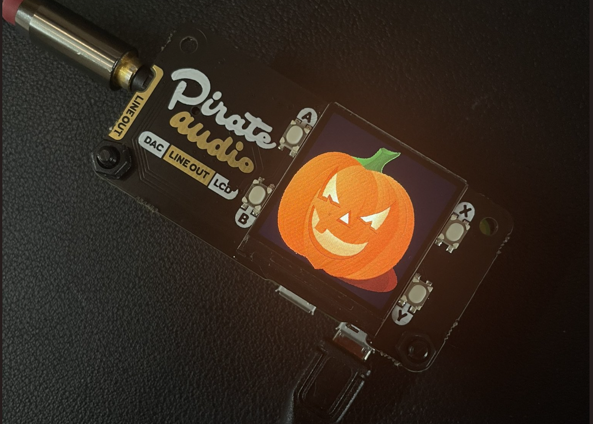

# halloween-sound-board
raspberry pi based halloween sound board

[](https://dashboard.balena-cloud.com/deploy?repoUrl=https://github.com/iayanpahwa/halloween-sound-board)




## Dependencies

### Hardware:
* tested with Raspberry pi zero w but should work with anmy raspberry pi 
* Pirate audio line-out pHAT by Pimoroni with hifiberry dac

### Configuration:
* replace audio files but keep the name same in audio-webapp/sound folder
* replace default display but keep the name same in display/images folder 
* if using DAC for sound output add ```BALENA_HOST_CONFIG_dtoverlay = hifiberry-dac``` in balena device configuration on balena cloud

### Software:
* balena OS